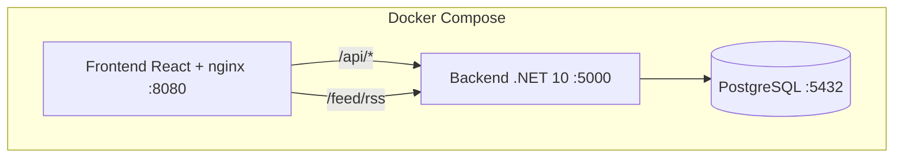

# Plateforme-CVTech

Monolithe modulaire .NET 10 — Job board, marketplace freelance et fil d'actualité tech.

---

## Lancement rapide

### Prérequis

- [Docker](https://docs.docker.com/get-docker/)
- [Docker Compose](https://docs.docker.com/compose/install/)

### Installation

```bash
git clone https://github.com/gansabi/Plateforme-CVTech
cd Plateforme-CVTech
cp .env.example .env
docker compose up --build
```

### Accès à l'application

| Service | URL |
|---|---|
| Frontend | http://localhost:8080 |
| Backend API | http://localhost:5000 |
| Swagger | http://localhost:5000/swagger |
| Flux RSS | http://localhost:5000/feed/rss |

### Comptes de démonstration

| Email | Mot de passe | Rôle |
|---|---|---|
| admin@cvtech.fr | Demo2026! | Administrateur |
| candidat@demo.fr | Demo2026! | Candidat |
| entreprise@techcorp.fr | Demo2026! | Entreprise |

### Arrêt

```bash
docker compose down
```

### Réinitialisation complète

```bash
docker compose down -v
docker compose up --build
```

---

## Tests

```bash
# Exécuter tous les tests (327 tests, 0 échec)
dotnet test backend/PlateformeCVTech.sln

327 tests, 0 échec. Les tests utilisent EF Core InMemory (pas de PostgreSQL requis).

---

## Présentation

Le marché du travail tech est fragmenté. Plateforme-CVTech réunit sur un seul site :

1. Un job board (CDI, CDD, stage, alternance, apprentissage)
2. Une marketplace freelance (appels d'offre, TJM, propositions)
3. Un fil d'actualité tech en RSS 2.0
4. Des notifications par domaine métier

### Utilisateurs

| Rôle | Description |
|---|---|
| Candidat | CV, candidatures, propositions freelance, abonnements |
| Entreprise | Annonces, appels d'offre, consultation des réponses |
| Administrateur | Modération, articles, gestion comptes |
| Visiteur anonyme | Consultation publique (annonces, AO, RSS) |

---

## Arborescence du projet

```
Plateforme-CVTech/
├── docker-compose.yml          # PostgreSQL + Backend + Frontend
├── .env.example                # Variables d'environnement
├── .agent/skills/              # Règles IA (5 fichiers)
│
├── backend/                    # .NET 10 — API REST
│   ├── src/Host/               # Point d'entrée (Program.cs, Seed, Config)
│   ├── src/Modules/            # 4 modules métier (5 couches chacun)
│   └── tests/Modules/          # 327 tests unitaires
│
└── frontend/                   # React 18 + TypeScript + Tailwind
    ├── src/app/                # Router, Auth, Layout
    ├── src/modules/            # Pages par module métier
    └── src/shared/             # API client, composants partagés
```

---

## Architecture



### 4 Modules métier

| Module | Responsabilité |
|---|---|
| GestionIdentite | Inscription, connexion, permissions |
| CatalogueEmploi | Annonces, CV, candidatures |
| AppelOffreFreelance | Appels d'offre, propositions |
| ActualiteEtAbonnement | Articles RSS, abonnements, notifications |

Structure par module : `Client → Application → Domaine → Infrastructure → Loader`

---

## Technologies

| Composant | Stack |
|---|---|
| Backend | .NET 10, MediatR, FluentValidation, EF Core |
| Frontend | React 18, TypeScript, Vite, Tailwind CSS, TanStack Query |
| Base de données | PostgreSQL 16 |
| Tests | xUnit, FluentAssertions, Moq (324 tests) |
| Conteneurisation | Docker, Docker Compose |

---

## Variables d'environnement

Fichier `.env.example` (à copier en `.env`) :

```env
POSTGRES_DB=cvtech
POSTGRES_USER=cvtech
POSTGRES_PASSWORD=cvtech2026
POSTGRES_PORT=5433
API_PORT=5000
FRONT_PORT=8080
```

---

## Base de données

- PostgreSQL 16 dans Docker
- Tables créées automatiquement au démarrage (EnsureCreated)
- Données de démo injectées automatiquement
- Persistance via volume Docker `pgdata`

---


## API — Endpoints

### GestionIdentite
- POST `/api/identite/comptes-candidats`
- POST `/api/identite/comptes-entreprises`
- POST `/api/identite/auth/connexion`
- POST `/api/identite/admin/comptes/{id}/bloquer`
- POST `/api/identite/admin/comptes/{id}/reactiver`

### CatalogueEmploi
- GET/POST `/api/catalogue/annonces`
- POST `/api/catalogue/candidatures` | GET (par annonce)
- POST/PUT `/api/catalogue/cv`
- POST `/api/catalogue/moderation/moderer` | `/supprimer`

### AppelOffreFreelance
- GET/POST `/api/freelance/appels-offre`
- POST `/api/freelance/propositions` | GET (par AO)
- POST `/api/freelance/moderation/moderer` | `/supprimer`

### ActualiteEtAbonnement
- GET `/feed/rss` (public, RSS 2.0)
- POST `/api/actualite/articles`
- POST `/api/actualite/abonnements`

---

## Parcours utilisateur

| Rôle | Actions |
|---|---|
| Candidat | Inscription → CV → Postuler → Proposer → S'abonner |
| Entreprise | Inscription → Publier annonce/AO → Consulter réponses |
| Administrateur | Modérer → Bloquer comptes → Publier articles |
| Visiteur | Consulter annonces, AO, RSS (sans compte) |


---

### Tableau récapitulatif

| Critère | Statut | Détail |
|---|---|---|
| Qualité DX | ✅ | `cp .env.example .env && docker compose up --build` → app fonctionnelle |
| Langage Métier Cohérent | ✅ | Domaine/Application en français, technique en anglais |
| Étanchéité des Modules | ✅ | Communication via événements MediatR + IVerificateurPermission |
| Matrice de Permissions | ✅ | 42 vérifications dans les handlers, 36 tests de refus |
| RSS éditorial | ✅ | GET /feed/rss — RSS 2.0, articles uniquement, filtrage par domaine |
| Abonnements / Notifications | ✅ | Abonnement → Publication → Notification (console email) |
| Autonomie des Skills | ✅ | 5 fichiers dans .agent/skills/, 253 règles explicites |
| Couverture TDD | ✅ | 324 tests xUnit, nommage français, Red/Green/Refactor |

### Modules back-end

| Module | Couches | Cas d'usage | Tests | Endpoints |
|---|---|---|---|---|
| GestionIdentite | 5/5 | 6 (inscription, connexion, blocage) | 191 | 6 |
| CatalogueEmploi | 5/5 | 8 (annonces, CV, candidatures, modération) | 64 | 8 |
| AppelOffreFreelance | 5/5 | 6 (AO, propositions, modération) | 41 | 6 |
| ActualiteEtAbonnement | 5/5 | 5 (articles, RSS, abonnements, notifications) | 31 | 3 |

### Frontend React

| Parcours | Pages | Fonctionnel |
|---|---|---|
| Visiteur anonyme | Annonces, Appels d'offre, Actualités RSS | ✅ |
| Candidat | Inscription, CV, Postuler, Proposer, Abonnements | ✅ |
| Entreprise | Inscription, Publier annonce/AO, Candidatures, Propositions | ✅ |
| Administrateur | Modération, Gestion comptes, Publication articles | ✅ |

### Infrastructure

| Élément | Implémenté |
|---|---|
| PostgreSQL (Docker) | ✅ |
| EF Core (Npgsql) | ✅ |
| Création automatique des tables | ✅ |
| Seed données de démo | ✅ |
| Volume Docker persistant | ✅ |
| Fichier .env.example | ✅ |
| Swagger | ✅ |
| CORS | ✅ |
| Proxy nginx (frontend → backend) | ✅ |

### AI Skills

| Fichier | Rôle |
|---|---|
| architecture-monolithe.md | Structure 5 couches, isolation modules, événements |
| regles-permissions.md | Vérification obligatoire, matrice par rôle |
| regles-tdd.md | Cycle TDD, nommage français, couverture |
